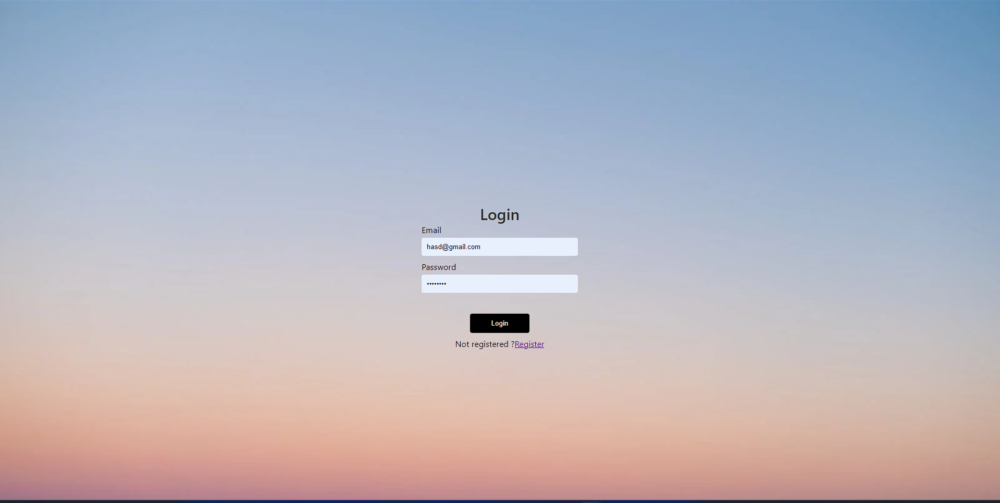

# TO-DO-LIST

By using the to-do-list, you can create task and when finished you can mark it as done or delete the task. 

## Follow these steps to run the project. 

 step 1 : clone this repository

 step 2 : open the project in your code editor and in terminal navigate to client folder.

 step 3 : use the command "npm install" or "yarn" to add essential libraries to project.

 step 4 : Repeat step 2 and 3 for the server folder too.

 step 5 : After installing the dependencies create .env folder and add Monodb Url and jwt secret 

 step 5 : Use the command "npm start" in both client and  server to run the project

## Screenshots

